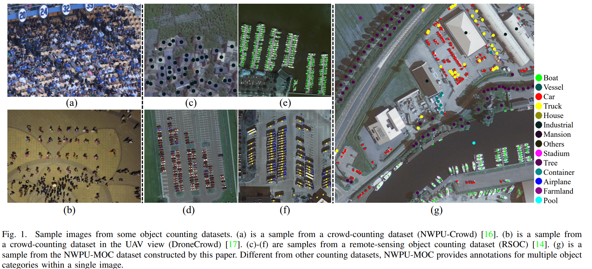
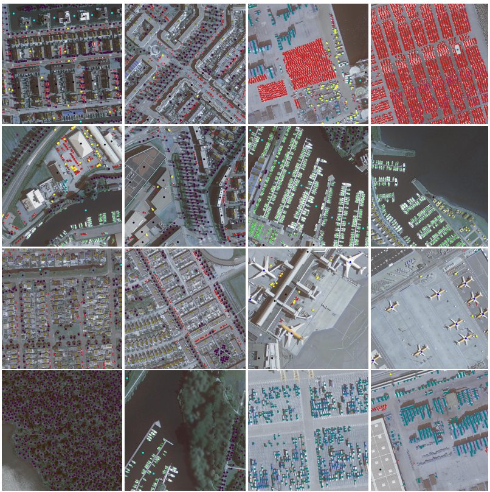
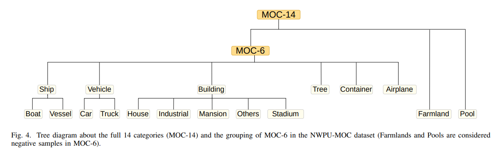

# NWPU-MOC dataset and  Sample Code

---

This repo is the official implementation of the paper: **NWPU-MOC: A Benchmark for Fine-grained Multi-category Object Counting in Aerial Images**. 





# Getting Started

## Preparation

- Installation

  - Clone this repo:

    ```
    git clone https://github.com/lyongo/NWPU-MOC.git
    ```

- Data Preparation

  - Download NWPU-MOC dataset from [GoogleDrive](https://drive.google.com/file/d/1AHOBAzOag0jlH3cLjukXdMYsCJhYaiOi/view?usp=drive_link) or [BaiduNetDisk](https://pan.baidu.com/s/145ajOgWBNF_KRb04mDTtkg?pwd=nwpu). 
  - Unzip ```*zip``` files. Finally, the folder tree is below:

  ```
    -- NWPU-MOC
      ├── annotations
      │   ├── airplane
      │   ├── boat
      │   ├── car
      │   ├── container
      │   ├── farmland
      │   ├── house
      │   ├── industrial
      │   ├── mansion
      │   ├── other
      │   ├── pool
      │   ├── stadium
      │   ├── tree
      │   ├── truck
      │   └── vessel
      │       └── jsons
      │           ├── A0_2020_orth25_0_8_1.json
      │           ├── A0_2020_orth25_0_8_2.json
      │           ├── ...
      │           └── A7_2020_orth25_9_7_4.json
      ├── gt
      │   ├── A0_2020_orth25_0_8_3.npz
      │   ├── A0_2020_orth25_1_10_2.npz
      │   ├── ...
      │   └── A7_2020_orth25_9_7_4.npz
      ├── gt14
      │   ├── A0_2020_orth25_0_8_1.npz
      │   ├── A0_2020_orth25_0_8_2.npz
      │   ├── ...
      │   └── A7_2020_orth25_9_7_4.npz
      ├── ir
      │   ├── A0_2020_ir_0_8_1.png
      │   ├── A0_2020_ir_0_8_2.png
      │   ├── ...
      │   └── A7_2020_ir_9_7_4.png
      ├── rgb
      │   ├── A0_2020_orth25_0_8_1.png
      │   ├── A0_2020_orth25_0_8_2.png
      │   ├── ..
      │   └── A7_2020_orth25_9_7_4.png
      ├── test.txt
      ├── train.txt
      └── val.txt
  ```

  

  

  

  - Modify ```__C_MOC_RS.DATA_PATH``` in ```./datasets/setting/MOC.py``` with the your dataset path.


## Training

- Set the parameters in ```config.py``` and ```./datasets/setting/MOC.py``` .
- run ```python train.py```.

## Testing

We only provide an example to forward the model on the test set. You may need to modify it to test your models.

- Run ```python test.py```. 

## Pre-trained Models


# Performance on the validation set


# Citation

If you find this project useful for your research, please cite:

```
@ARTICLE{10410235,
  author={Gao, Junyu and Zhao, Liangliang and Li, Xuelong},
  journal={IEEE Transactions on Geoscience and Remote Sensing}, 
  title={NWPU-MOC: A Benchmark for Fine-grained Multi-category Object Counting in Aerial Images}, 
  year={2024},
  volume={},
  number={},
  pages={1-1},
  keywords={Task analysis;Remote sensing;Automobiles;Cranes;Buildings;Annotations;Vegetation;Benchmark;object counting;multi-spectral aerial image;remote sensing},
  doi={10.1109/TGRS.2024.3356492}}

```

Our code borrows a lot from the C^3 Framework, you may cite:

```
@article{gao2019c,
  title={C$^3$ Framework: An Open-source PyTorch Code for Crowd Counting},
  author={Gao, Junyu and Lin, Wei and Zhao, Bin and Wang, Dong and Gao, Chenyu and Wen, Jun},
  journal={arXiv preprint arXiv:1907.02724},
  year={2019}
}
```
